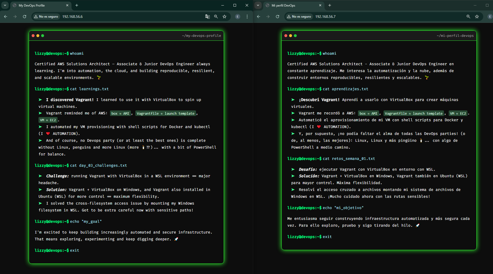

## English Version

- [Haz clic aquí para la versión en Español](#versión-en-español)

# DevOps Lab with Vagrant & VirtualBox  
_Created as part of the [90 Días de DevOps con Roxs](https://github.com/roxsross/90daysdevopsbyroxs) challenge_

## 📦 About this project

This project uses **Vagrant** and **VirtualBox** to create and provision a local virtual machine. It automatically installs:

- [x] Nginx to serve a static website.
- [x] Docker.
- [x] kubectl.

You can choose between:
- `vm-es/`: Spanish version of the website.
- `vm-en/`: English version of the website.

Everything is done using **shell provisioning scripts**, demonstrating basic Infrastructure as Code (IaC) principles.

---

## 🛠️ What is Vagrant?

Vagrant is an open-source tool that helps you create and manage virtual machine environments easily. It provides a simple and consistent workflow to set up reproducible development environments by automating the creation and configuration of VMs, usually using providers like VirtualBox, VMware or others. This allows developers and DevOps engineers to focus on their code and infrastructure without worrying about manual setup.

---

## 🧰 Requirements

Make sure you have the following installed on your machine:

- [VirtualBox](https://www.virtualbox.org/).
- [Vagrant](https://www.vagrantup.com/).

---

## 🔧 Project structure

```
devops-vagrant-lab/
├── vm-en/
│   ├── Vagrantfile
│   ├── static_website/
│   │   ├── index.html
│   │   └── styles.css
│   └── scripts/
│       ├── install_docker.sh
│       └── install_nginx.sh
├── vm-es/
│   ├── Vagrantfile
│   ├── static_website/
│   │   ├── index.html
│   │   └── styles.css
│   └── scripts/
│       ├── install_docker.sh
│       └── install_nginx.sh
```

---

### Provisioning scripts

- `install_nginx.sh`: installs the Nginx web server and configures it to serve the static website by copying the files to `/var/www/html/`. This ensures your site is accessible when the VM is running.

- `install_docker.sh`: installs Docker and kubectl. Docker will let you run containers inside the VM, and kubectl is the Kubernetes CLI tool, prepared here for future Kubernetes-related work or practice.

---
## 🚀 How to use

1. **Clone the repository**

```bash
git clone https://github.com/DevLizOps/devops-vagrant-lab.git
cd devops-vagrant-lab/vm-en  # or vm-es for Spanish version
```

2. **Start the virtual machine**

```bash
vagrant up
```

This will:

- Download the Ubuntu 22.04 base image (if needed).

- Start the VM.

- Run provisioning scripts to install Nginx, Docker and kubectl.

- Copy the static website into `/var/www/html/`.

3. **View the static website**

Open your browser and go to: http://192.168.56.6.

> This IP is configured in the `Vagrantfile` as a private network.



4. **Access the virtual machine**

If you want to explore the virtual machine or run manual commands, you can SSH into it:

```bash
vagrant ssh
```

Use this to verify installed tools, inspect logs, or continue experimenting inside the VM.

## 🧹 Shutting down and cleaning up

Once you're done testing the project, you can stop and remove the virtual machine:

```bash
vagrant halt    # Gracefully shuts down the VM
vagrant destroy # Destroys the VM and deletes all resources
```

This helps free up disk space and keeps your system clean.

## 🧠 Key Learnings

- Automating VM provisioning with Vagrant.
- Using shell scripts to install Docker & kubectl.

## 📄 License

This project is licensed under the [MIT License](LICENSE).  
Feel free to use, modify and share it as long as you keep the original license notice.

> 🌱 Feel free to clone this project and customize the static site with your own DevOps journey.

---

## Versión en Español

- [Click here for the English Version](#english-version)

# Laboratorio DevOps con Vagrant y VirtualBox  
_Creado como parte del reto [90 Días de DevOps con Roxs](https://github.com/roxsross/90daysdevopsbyroxs)_

## 📦 Sobre este proyecto

Este proyecto utiliza **Vagrant** y **VirtualBox** para crear y aprovisionar una máquina virtual local. Instala automáticamente:

- [x] Nginx para servir una página web estática.
- [x] Docker.
- [x] kubectl.

Puedes elegir entre:
- `vm-es/`: versión en español del sitio web.
- `vm-en/`: versión en inglés del sitio web.

Todo se realiza mediante **scripts de aprovisionamiento en shell**, demostrando principios básicos de Infrastructure as Code (IaC).

---

## 🛠️ ¿Qué es Vagrant?

Vagrant es una herramienta de código abierto que facilita la creación y gestión de entornos con máquinas virtuales. Ofrece un flujo de trabajo sencillo y uniforme para montar entornos de desarrollo reproducibles, automatizando la creación y configuración de VMs con proveedores como VirtualBox, VMware u otros. Así, desarrolladores e ingenieros DevOps pueden centrarse en su código e infraestructura sin preocuparse por la configuración manual.

---

## 🧰 Requisitos

Asegúrate de tener lo siguiente instalado en tu equipo:

- [VirtualBox](https://www.virtualbox.org/).
- [Vagrant](https://www.vagrantup.com/).

---

## 🔧 Estructura del proyecto

```
devops-vagrant-lab/
├── vm-en/
│   ├── Vagrantfile
│   ├── static_website/
│   │   ├── index.html
│   │   └── styles.css
│   └── scripts/
│       ├── install_docker.sh
│       └── install_nginx.sh
├── vm-es/
│   ├── Vagrantfile
│   ├── static_website/
│   │   ├── index.html
│   │   └── styles.css
│   └── scripts/
│       ├── install_docker.sh
│       └── install_nginx.sh
```

### Scripts de aprovisionamiento

- `instalar_nginx.sh`: instala el servidor web Nginx y lo configura para servir la página estática, copiando los archivos a `/var/www/html/`. Esto garantiza que tu sitio esté accesible cuando la máquina virtual esté activa.

- `instalar_docker.sh`: instala Docker y kubectl. Docker permite ejecutar contenedores dentro de la VM, y kubectl es la herramienta de línea de comandos de Kubernetes, preparada aquí para futuros trabajos o prácticas con Kubernetes.

---

## 🚀 Cómo usarlo

1. **Clona el repositorio**

```bash
git clone https://github.com/DevLizOps/devops-vagrant-lab.git
cd devops-vagrant-lab/vm-es  # o vm-en para la versión en inglés
```

2. **Inicia la máquina virtual**

```bash
vagrant up
```

Esto hará lo siguiente:

- Descargar la imagen base de Ubuntu 22.04 (si es necesario).

- Iniciar la máquina virtual.

- Ejecutar los scripts de aprovisionamiento para instalar Nginx, Docker y kubectl.

- Copiar la página estática a `/var/www/html/`.

3. **Visualiza la página estática**

Abre tu navegador y visita: http://192.168.56.7.

> Esta IP está configurada en el `Vagrantfile` como una red privada.

4. **Accede a la máquina virtual**

Si quieres explorar la máquina virtual o ejecutar comandos manualmente, puedes conectarte por SSH:

```bash
vagrant ssh
```

Esto te permitirá verificar herramientas instaladas, revisar logs o seguir haciendo pruebas dentro de la VM.


## 🧹 Apagar y limpiar

Una vez hayas terminado de probar el proyecto, puedes detener y eliminar la máquina virtual:

```bash
vagrant halt    # Gracefully shuts down the VM
vagrant destroy # Destroys the VM and deletes all resources
```

Esto ayuda a liberar espacio en disco y mantener tu sistema limpio.

## 🧠 Aprendizajes clave

- Automatización del aprovisionamiento de máquinas virtuales con Vagrant.
- Uso de scripts en shell para instalar Docker y kubectl.

---

## 📄 Licencia

Este proyecto está bajo la [Licencia MIT](LICENSE).  
Puedes usarlo, modificarlo y compartirlo libremente siempre que conserves el aviso original de la licencia.

> 🌱 Siéntete libre de clonar este proyecto y personalizar el sitio estático con tu propia historia DevOps.
